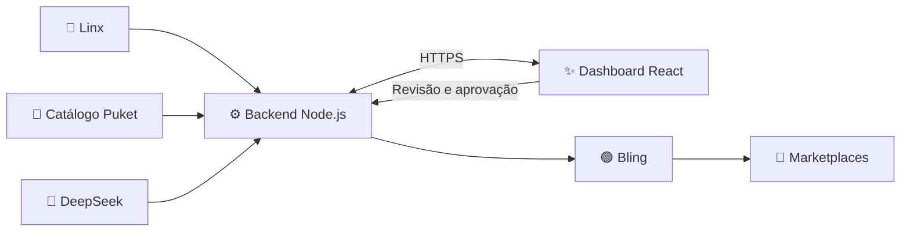

<div align="center">

# 🧦 Gestão de Estoque Puket

### Menos cliques, mais magia ✨

Plataforma interna que conecta **Linx**, **Catálogo Puket** e **Bling** para automatizar cadastros, variações, kits, conteúdo e estoque.


---

**[Recursos](#-o-que-a-plataforma-faz) • [Arquitetura](#-arquitetura) • [Instalação](#-primeiros-passos) • [Operação](#-uso-diário) • [Segurança](#-segurança)**

</div>

> [!IMPORTANT]
> Este é um sistema interno. Credenciais, tokens OAuth, sessões e arquivos `.env` nunca devem ser adicionados ao Git.

## 🎯 Por que este projeto existe?

Cadastrar um produto completo exige consultar diferentes sistemas, organizar imagens e descrições, criar variações, conferir estoque e preencher o Bling. Para kits, o processo fica ainda mais demorado.

Esta plataforma centraliza esse fluxo: a pessoa informa o SKU, revisa o resultado e aprova o envio. Uma operação que antes consumia horas passa a acontecer em poucos minutos.

## 🚀 O que a plataforma faz

| Módulo | Automação |
|---|---|
| 📦 **Cadastro sob demanda** | Processa vários SKUs e cadastra somente os itens selecionados |
| 👕 **Produtos e variações** | Cria produto-pai com cores e tamanhos encontrados |
| 🧩 **Variações ausentes** | Compara o cadastro e inclui apenas o que estiver faltando |
| 🎁 **Kits** | Localiza ou cria componentes e monta a estrutura correta no Bling |
| 🛒 **Catálogo integrado** | Pesquisa o catálogo interno e envia produtos a partir da dashboard |
| 🖼️ **Conteúdo** | Importa descrições e múltiplas imagens por produto |
| 🤖 **Descrição com IA** | Gera uma descrição SEO editável antes da aprovação |
| 📊 **Estoque** | Consulta o Linx e sincroniza os saldos com o Bling |
| 🔍 **Conferência** | Mostra uma prévia completa antes de qualquer gravação |
| 🕘 **Histórico** | Registra etapas, resultados e falhas das automações |
| 💬 **Copiloto IA** | Interpreta consultas em linguagem natural e prepara ações controladas |

## 🧠 Arquitetura



```text
Gestao-Estoque-Puket/
├── backend/     # API, regras de negócio e integrações
├── frontend/    # Dashboard React + TanStack
├── .gitignore   # Proteção de credenciais e dados locais
└── README.md
```

### 🔐 Limite de segurança

O navegador acessa somente o backend. As credenciais do Linx, Bling e DeepSeek permanecem no servidor e **nunca são entregues ao frontend**.

## 🧰 Tecnologias

| Camada | Tecnologias principais |
|---|---|
| Frontend | React 19, TypeScript, TanStack Start, Tailwind CSS e Radix UI |
| Backend | Node.js e APIs HTTP |
| Inteligência artificial | DeepSeek |
| Integrações | Linx, Catálogo Puket e Bling API v3 |
| Publicação | Lovable + Cloudflare Tunnel |

## ⚡ Primeiros passos

### Pré-requisitos

- Node.js 20 ou superior
- npm
- Credenciais autorizadas do Linx, Bling e DeepSeek
- Cloudflare Tunnel para conectar o backend local ao site publicado

<details>
<summary><strong>🖥️ Configurar o backend</strong></summary>

```bash
cd backend
npm install
```

Copie `backend/.env.example` para `backend/.env` e preencha somente no computador que executará o servidor.

Iniciar localmente:

```bash
npm start
```

Iniciar para uso com o túnel:

```bash
npm run start:tunnel
```

Por padrão, a API atende em `http://localhost:3030`.

</details>

<details>
<summary><strong>🎨 Configurar o frontend</strong></summary>

```bash
cd frontend
npm install
npm run dev
```

Defina `VITE_API_URL` com a URL pública HTTPS do backend.

Validar o build de produção:

```bash
npm run build
```

</details>

## 💡 Uso diário

Para utilizar o site publicado, mantenha duas coisas funcionando no computador responsável pelas integrações:

1. 🟢 O serviço **Cloudflared** deve estar em execução.
2. 🟢 O **backend** deve estar iniciado com `npm run start:tunnel`.

O frontend fica hospedado no Lovable. O túnel permanente encaminha as chamadas HTTPS para o backend local na porta `3030`.

> [!TIP]
> Se o site mostrar **Backend offline**, confira primeiro o backend local e depois o serviço Cloudflared.

## 🛡️ Segurança

- ❌ Nunca versione `.env`, senhas, tokens OAuth ou arquivos de sessão.
- 🔄 Revogue imediatamente qualquer token exposto em conversa, captura de tela ou log.
- 🔒 Mantenha este repositório privado.
- 👀 Revise a prévia antes de gravar alterações no Bling.
- 🌐 Restrinja `ALLOWED_ORIGINS` aos endereços oficiais do frontend.
- 🧹 Não envie inventários, notas fiscais, arquivos HAR ou dados operacionais.

> [!WARNING]
> O sistema opera sobre cadastros reais. Teste mudanças de integração com poucos SKUs antes de executar um lote.

## 🗺️ Próximos passos

- [ ] Criar a área de **Saúde dos Cadastros**.
- [ ] Detectar campos incompletos, kits quebrados e variações inconsistentes.
- [ ] Avaliar a integração com Mercado Livre e Shopee.
- [ ] Organizar correções individuais e em massa com aprovação.
- [ ] Adicionar monitoramento preventivo e relatórios periódicos.

---

<div align="center">

Feito para transformar tarefas repetitivas em um fluxo simples, revisável e seguro. 🧦✨

</div>
